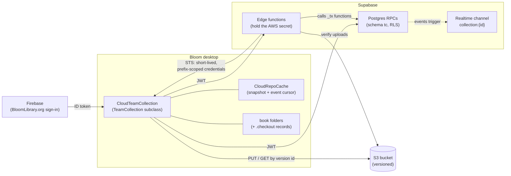
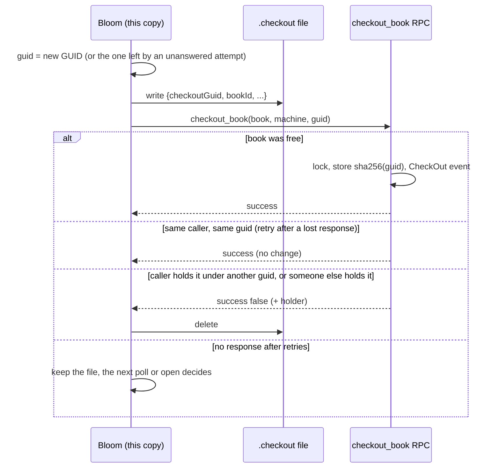
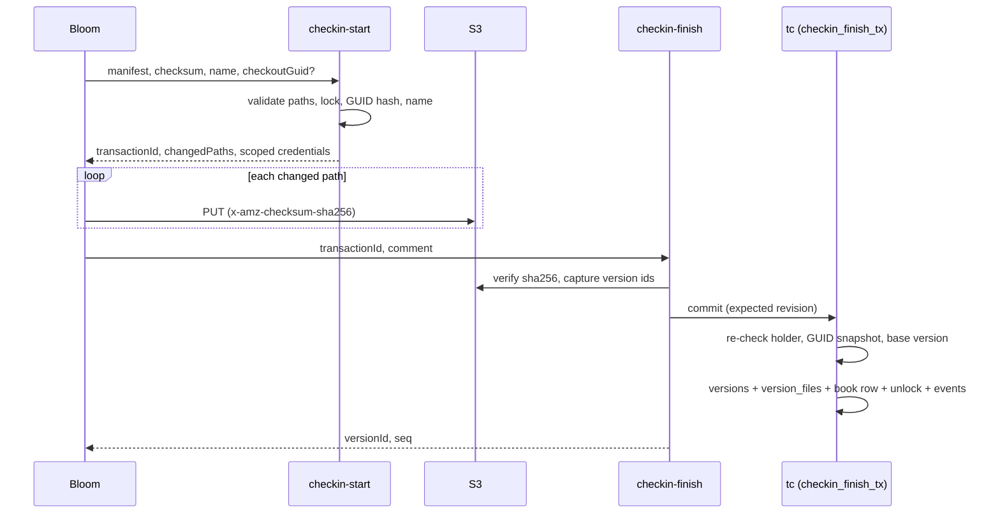
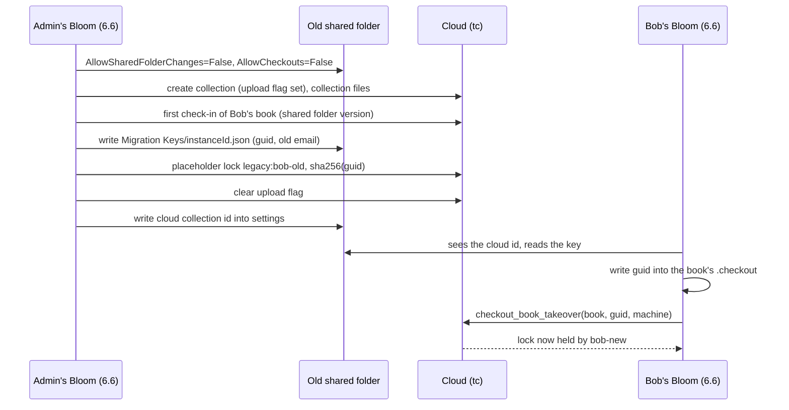
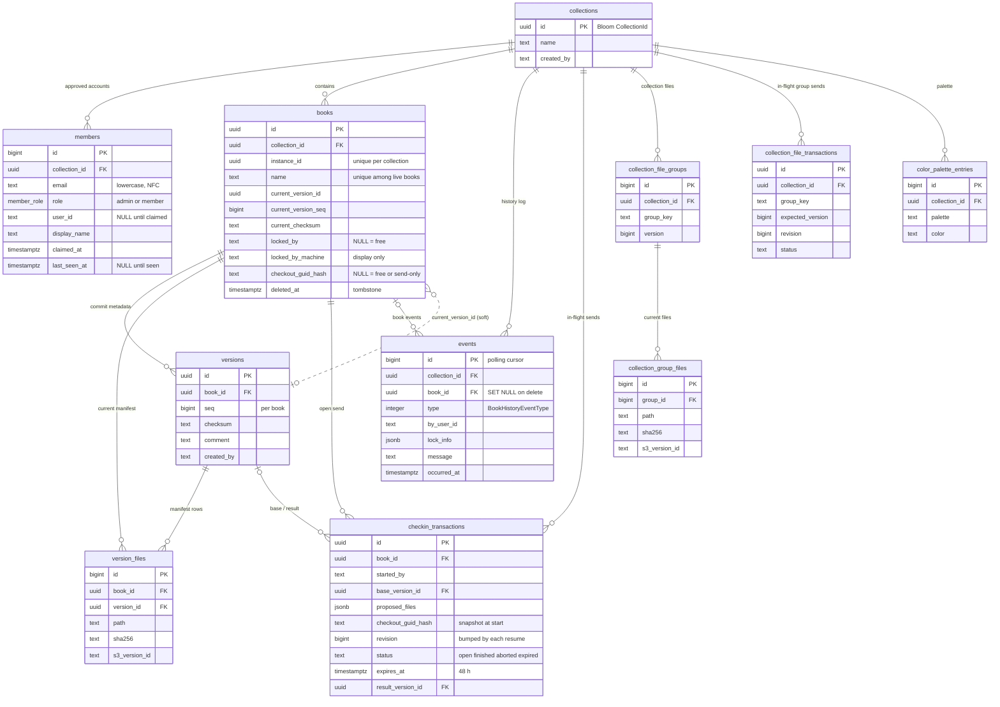

# Cloud Team Collections

A design overview for developers new to Cloud Team Collections: what they are for, how the parts
fit together, how a book moves through checkout and check-in, what the database looks like, and
what is still open. It describes the design as it stands in September 2026.

> **Where things are.** This overview lands on `master` before most of what it describes.
>
> - **Server** (Postgres schema `tc`, RLS, RPCs, edge functions, local dev stack): the
>   `bloom-core-supabase` repo, PR #13, branch `BL-16531-tc-backend`. Its detailed docs are in
>   `team-collections/docs/`: `CONTRACTS.md` (the wire contract, currently **v1.10**), `SCHEMA.md`
>   (ER diagram and notes) and `GOING-LIVE.md` (deployment runbook). Not deployed anywhere yet.
> - **Desktop client** (`CloudTeamCollection` and its helpers, the sign-in and join UI, unit and
>   E2E tests): BloomDesktop draft PR #8052, branch `cloud-tc-for-review`, which also carries the
>   older project records in `Design/CloudTeamCollections/` (`CONTRACTS.md`, `SCHEMA.md`,
>   `IMPLEMENTATION.md`, `GOING-LIVE.md`, `docs/user-walkthrough.md`, and the dogfood and task
>   logs). Its `CONTRACTS.md`/`SCHEMA.md` are mirrors of the server repo's; the server repo's
>   copies are authoritative.
> - **The Share dialog** (who has access, and in what role): BloomDesktop PR #8394, branch
>   `BL-16673-share-dialog`, based on `master`. It currently stores its data in a local stand-in
>   file rather than on the server (see [Sharing UI](#sharing-ui-built)).
>
> Tracking: YouTrack BL-16531 (the whole feature, targeted at 6.6) and the cards tagged
> **Sharing** (BL-16672 to BL-16676, BL-16527).

## 1. Goals

Folder-based Team Collections wrap a shared Dropbox or LAN folder. They are hard for users to set
up, Bloom can never know for sure what the sync agent has delivered, and a third-party sync
underneath Bloom produces a long tail of races (conflicted copies, half-delivered books, zip files
that look corrupt because they are still arriving). Cloud Team Collections replace the shared
folder with a service Bloom controls:

1. **Sharing is controlled by Bloom.** An admin gives people access by entering the email address
   of their BloomLibrary.org account; each person signs in to Bloom with that account. No Dropbox,
   no shared folder, no third-party account.
2. **Reliability comes from the database.** Locks, versions and history live in a transactional
   Postgres database, so most of the old races become impossible rather than merely handled. Every
   change of state is one atomic database transaction.
3. **The editorial model is unchanged.** Books are still checked out, edited (offline if need be)
   and checked in. Content moves only on explicit, progress-reported transfers ("Send" and
   "Receive"); metadata (who has what checked out, which version exists) stays current in the
   background.
4. **Work is never silently lost.** Whenever the shared version must win over local work, the local
   work is saved as a `.bloomSource` in the collection's `Lost and Found` folder and recorded as an
   incident in the history.
5. **Coexistence.** Cloud Team Collections are a second implementation behind the existing
   `TeamCollection` abstraction; folder Team Collections keep working unchanged.

Non-goals for the first release: keeping old versions of books (S3 versioning is used only as a
transactional safety net), sharing single books, and server-side subscription enforcement (the
client's subscription-tier gate is the only check).

Cloud Team Collections are not part of Bloom 6.5. They are to be fully live in 6.6, though perhaps
still marked experimental. No environment variable gates them; the `cloudCollections` variable
that hides the old opt-in checkbox in the #8052 client goes away when the Share dialog replaces
that checkbox.

## 2. Architecture



- **Bloom desktop.** `CloudTeamCollection` subclasses the abstract `TeamCollection`, so
  `SyncAtStartup`, the conflict logic, the message log and most of the Team Collection UI are
  shared with folder Team Collections. Helpers: `CloudCollectionClient` (RPC and edge-function
  calls), `CloudRepoCache` (a thread-safe, disk-persisted snapshot of server state plus the event
  cursor, which also serves the Disconnected state when offline), `CloudBookTransfer` and
  `BookVersionManifest` (per-file delta upload and download), `CloudCheckoutFile` (the `.checkout`
  record), `CloudCollectionMonitor` (polling), `CloudAuth` with its Firebase and local providers,
  and `CloudJoinFlow`. `TeamCollectionLink.txt` holds either a folder path or
  `cloud://sil.bloom/collection/<collectionId>`, and the factory picks the subclass from it; an
  older Bloom reads a cloud link as a missing folder and lands in the Disconnected state.
- **Postgres RPCs** run inside the database and are exposed by PostgREST at `/rest/v1/rpc/...`
  (schema `tc`, so calls carry `Content-Profile: tc`). Row-level security gates every call;
  clients never write tables directly. Single-step database work is an RPC.
- **Edge functions** are TypeScript on Supabase's edge runtime, at `/functions/v1/<name>`. They are
  the only code holding the AWS secret, so anything that vends S3 credentials or verifies S3 objects
  is an edge function. They call internal `_tx` database functions to commit. The finish functions
  call those with the service-role key; members cannot call them directly.
- **S3.** One bucket per environment, object versioning on, lifecycle rules that abort stale
  multipart uploads and expire non-current versions after about 7 days. Edge functions hand the
  client STS credentials scoped by an inline session policy: write access only to the one book
  being sent (1 hour), or read access (`GetObject` + `GetObjectVersion`) to the collection prefix.
- **Realtime.** An `AFTER INSERT` trigger on `tc.events` broadcasts each event on the private
  channel `collection:{uuid}` (event name `tc_event`, members only). The client does not subscribe
  yet: it polls, and realtime is an optimization for later, never a dependency.
- **Environments** are chosen by configuration (`BLOOM_CLOUDTC_*`), never by code: **local** (the
  on-machine emulation: local Supabase plus MinIO), **dev/sandbox** (a hosted test project with
  real S3) and **production**.

## 3. Identity, membership and roles

### Identity

A person is their **BloomLibrary.org account**. Sign-in uses Supabase's third-party Firebase auth:
the BloomLibrary login page hands Bloom the Firebase ID and refresh tokens it already has (#8052
adds a `POST /bloom/api/external/cloudLogin` endpoint for this, next to the existing
`external/login`), and every request carries the Firebase ID token as its bearer JWT. The server
uses its `sub` (user id), `email` and `email_verified` claims and never trusts an identity the
client sends: lock holders and history authors come from the token. The machine name the client
sends is for display only.

### Members and invitations

`tc.members` is the list of approved accounts for a collection. An admin adds a row by email
(lowercased and NFC-normalized) with a role; the row has no `user_id` until the person signs in and
`claim_memberships()` fills it in, which requires a verified email. So "invited" means a row with
no `user_id`, and "joined" means a claimed row. Adding the row is all that inviting someone
involves: nothing is sent, and the invitation card the person sees in Bloom comes from
`my_collections()` listing that row. `my_collections()` lists the collections an email
has been approved for, claimed or not, which is what the join UI shows. `members_list` is visible
to any member; `members_add`, `members_remove` and `members_set_role` are admin-only. Removing a
member also force-unlocks everything they had checked out, with a ForcedUnlock event for each
book. `members_set_display_name` sets the name shown instead of the email (an admin for anyone, a
claimed member for themself).

A trigger (`members_last_admin_guard`) refuses to delete or demote a collection's last admin,
locking the collection row first so two concurrent demotions cannot both succeed. If a collection
loses every reachable admin anyway, the Bloom team can run `support_set_admin` with the
service-role key (see `GOING-LIVE.md`, "Admin recovery").

### Roles

There are two roles. The UI calls them **Admin** and **Editor**; the database enum
`tc.member_role` calls them `admin` and `member`.

| Role   | May                                                                 |
| ------ | ------------------------------------------------------------------- |
| Editor | add, remove and edit books (check out, check in, delete a book they hold) |
| Admin  | everything an Editor may, plus collection settings, sharing, force unlock, undelete |

A person who opens a cloud collection in a folder another account joined is checked at open. If
the signed-in account is not a member, Bloom refuses to open the collection, naming the signed-in
account, the admins to ask, and the last person known to have used that folder. If it is a member,
Bloom claims the membership if needed and opens normally (see
[Transferring a checkout to a new login](#transferring-a-local-checkout-to-a-new-login)).

### Sharing UI (built)

PR #8394 adds a **Share** button to the Collection tab's top bar, next to Settings and Other
Collection. It opens **Share "&lt;collection name&gt;"** (`src/BloomBrowserUI/sharing/ShareDialog.tsx`,
served by `src/BloomExe/web/controllers/SharingApi.cs`, with the model and rules in
`src/BloomExe/Sharing/`):

- **Sign in first.** Signed out, the dialog asks you to sign in to BloomLibrary.org (through
  `AccountApi`); invitees use their own BloomLibrary.org accounts.
- **Invite by email address**, choosing Admin or Editor. Inviting only adds the address to the
  list of people allowed to use the collection; no email is sent (see "Being invited" below for how
  the person finds out). An invitation is all-or-nothing: if any address in a request already has
  access or appears twice, nothing is added. The email box and button are
  disabled while an invitation is being saved.
- **The member list** shows each person with their role. Under the role: **"Last seen &lt;when&gt;"**
  once Bloom knows they have used the collection (a signed-in member's visit is recorded when the
  collection opens and when the dialog loads), otherwise **"Invited &lt;when&gt;"**.
- **Admins manage others.** An admin can change another person's role or **Remove from
  collection** through a menu on that person's role. Nobody can change their own role or remove
  themself (a tooltip explains that another admin must do it). Because only admins can change
  anything and the one doing it stays an admin, a shared collection always has an admin. Editors
  see the same list read-only. Changes take effect immediately; the dialog has Close, not OK and
  Cancel (the pattern of Google Drive, Figma and Notion).
- **When a collection becomes shared.** An ordinary collection becomes shared with its first
  invitation, with the inviter as its admin; before that, only someone who may edit its settings
  can share it. A **folder Team Collection** becomes shared the first time one of its
  administrators opens Share. It starts with everyone its history shows has worked in it:
  **Admin** if they are in the Team Collection's administrators list, **Editor** otherwise, each
  "last seen" at their last recorded action. The admin removes anyone who should not be there.
  Removed people stay removed; opening Share again never re-adds them. A non-administrator who
  opens Share on an unshared Team Collection is told only an administrator can share it.
- **Learn about sharing** opens the Team Collections introduction in the browser until a sharing
  page exists.

**The backend behind this dialog is a stand-in.** `ICollectionSharingService` is implemented only
by `LocalFileCollectionSharingService`, which keeps the record in `sharing.local.json` in the
collection folder and enforces the rules the server will. Nobody invited sees an invitation card
yet, and a folder Team Collection does not sync the file. Sharing a Team Collection only sets up the
list of people; its books do not move anywhere yet (the design for that is
[section 5](#5-starting-a-cloud-collection-initial-upload-and-migration)).

### Sharing UI (planned, from the Sharing cards)

These are designs on cards, not built:

- **Subscription states** (BL-16672, Ready For UI Review). A Pro subscription lets you share with
  one other person, with an "upgrade your subscription" banner; a subscription without sharing
  shows the dialog with a "choose a subscription" banner and only yourself in the list.
- **Removing** (BL-16674, Ready For Work). Removing a joined member asks for confirmation: their
  copy stays on their computer but stops syncing, and if invited again they must download the whole
  collection again. A pending invitation's menu offers **Cancel invitation** (no follow-up dialog)
  and marks the row "Invite pending". Races between showing the menu and choosing an item are
  handled in whatever way is simplest.
- **Being invited** (BL-16675, Ready For Work; BL-16527, Open). Invitations are not emailed. When
  someone signed in to Bloom is allowed to use a cloud collection they have not joined yet, a
  special invitation card appears pinned first in Open/Create Collections, with **Download and
  Join**, and a badge on the Other Collection button. A first-time user must be asked to sign in
  before this screen.
- **Moving a folder Team Collection to the cloud** (BL-16676, Ready For UI Review). A mocked
  five-step dialog: enable cloud sync; a preparation phase in which everyone must upgrade to 6.6
  and check in, and no new checkouts are allowed; invite the team (from "People found in this
  collection's history", with roles); wait for everyone to accept; **Switch Now**, after which each
  Bloom disconnects from Dropbox for this collection, the old Dropbox folder is renamed "Old
  &lt;collection name&gt;", and checkouts are allowed again. Members see "Sharing has changed for
  ..." with Accept / Not Now. The mechanism behind it is designed in
  [section 5](#5-starting-a-cloud-collection-initial-upload-and-migration), which replaces the
  preparation phase and the waiting: the shared folder is frozen at once, the admin uploads in
  the background, people keep editing what they have checked out, and each member's 6.6 Bloom
  switches over by itself, carrying its checkouts with it, when the upload is done. The old
  folder must stay until everyone who had checkouts has switched. The #8394 behavior of sharing a
  Team Collection with its history's people is the first piece of this.

The #8052 client has its own earlier sharing UI (a Sharing panel in Settings for the approved list,
join cards in the collection chooser, a sign-in dialog). The Share dialog and the planned cards
replace it; reconciling the two is part of wiring the Share dialog to the server.

## 4. The book lifecycle

### Book identity and local state

A book is identified by its **instance id** (from `meta.json`), never by its name: `tc.books` has
`instance_id` unique per collection, and S3 keys use it, so a rename is just a column update. Names
are NFC-normalized and unique (case-insensitively) among live books. The client resolves books by
instance id, so a local book whose name matches a teammate's different book is never bound to it.

Locally, each book folder holds the book, the usual Team Collection status file, and, while the
book is checked out in that copy, a `.checkout` record. `CloudRepoCache` remembers the last server
state it saw and the local version each book was received or sent at.

### Checkout: the checkout GUID

A checkout belongs to **one copy of the book folder**, identified by a random GUID:

- **The client makes the GUID and writes it first.** It generates the GUID (lowercase "D" form),
  writes `<bookFolder>/.checkout` (BOM-free JSON: `version`, `checkoutGuid`, `bookId`,
  `collectionId`, `userEmail`, `checkedOutAt`), and only then calls
  `checkout_book(p_book_id, p_machine, p_checkout_guid)`. If the record can't be written, it doesn't
  ask. Writing first means a checkout whose response is lost can never strand the book.
- **The server stores only a hash**, `tc.books.checkout_guid_hash =
  lowercase-hex(SHA-256(UTF-8(lower(guid))))`. The hash is readable by members and comes back on
  every book row from `get_collection_state` and `get_changes` as `checkoutGuidHash`; a hash of 122
  random bits can't be reversed. The GUID itself is stored nowhere on the server.
- **Outcomes.** A free book is locked to the caller with the hash. The same caller retrying with
  the **same** GUID gets the same success again, changing nothing and emitting no second event, so
  a lost response is simply retried (the client retries twice with short delays). The caller
  holding the book under a **different** GUID (another copy), or under a send-only lock, gets
  `{success: false, locked_by_me: true}` and nothing changes. Someone else's lock gets the holder's
  identity. On any refusal the client deletes the record it wrote; if the outcome stays unknown it
  keeps the record and the next poll or open decides.
- **"Checked out here" means "in this copy".** A copy is where the book is checked out exactly when
  the server row is locked and the hash of the GUID in that copy's `.checkout` equals
  `checkoutGuidHash`. The machine doesn't matter, so a collection folder that is moved, renamed or
  copied to another computer keeps its checkouts. A copy without the current GUID sees the book as
  read-only, even for the same user; the way out is to go back to the copy that has it, or an
  admin's force unlock.
- The `.checkout` record never leaves the folder: it is not uploaded, packaged, copied into
  duplicates or publications, or zipped into Lost and Found copies.



### Obsolete `.checkout` records

At collection open, and after each poll that touched books, the client looks at every book folder
with a `.checkout`. The record is **obsolete** when the server row is unlocked or its
`checkoutGuidHash` isn't the hash of the record's GUID: the book was checked in or out from another
copy (for example the other half of a duplicated collection folder), an admin force-unlocked it, or
another account holds it. Cancelling an obsolete checkout:

1. If the local book is exactly the committed version (typically our own check-in committed but
   its answer was lost), delete the record and record the book as current, silently.
2. Otherwise, if the local book changed since the last sync, save it to Lost and Found (a
   WorkPreservedLocally incident, sub-case `ObsoleteCheckout`); delete the record; receive the
   repository version.

A book that might be open for editing (it is the selected book) is only made read-only; its
cancellation is retried on later polls and at the next open. While disconnected, a record is
trusted as it stands.

### Check-in: two-phase transactions

A check-in ("Send") is a transaction that the database commits in one step:

1. **`checkin-start`** receives the full proposed manifest (`files: [{path, sha256, size}]`, the
   checksum, the proposed name, and `checkoutGuid` for a book the caller has checked out). It
   NFC-normalizes and validates every path, checks the lock, the GUID and name uniqueness, gets S3
   credentials **before** taking any lock, diffs the manifest against the current version, and
   opens (or resumes) a row in `tc.checkin_transactions`. It records the book's current version as
   the transaction's base and the book's current `checkout_guid_hash` as a snapshot. It returns
   `transactionId`, `changedPaths` and write credentials for `tc/{cid}/books/{instanceId}/*`.
2. The client **uploads** each changed file to `prefix + changedPath` exactly as returned, with
   `x-amz-checksum-sha256`.
3. **`checkin-finish`** verifies every changed object's SHA-256 in S3, captures the S3 version ids,
   and calls `checkin_finish_tx`, which under row locks re-checks that the caller still holds the
   lock, that the book still has the snapshot hash, and that the book is still at the base
   version, then in one transaction appends a `versions` row, replaces the book's `version_files`,
   updates the book row, releases the lock (unless `keepCheckedOut`, which keeps the lock and the
   GUID), and writes events. A best-effort manifest backup is then written to S3.

Failure modes are all "nothing committed, try again": `MissingOrBadUploads` (re-upload the listed
paths; `stalePaths` names uploads older than the 24-hour commit window), `TransactionChanged` (a
concurrent start resumed the transaction while finish was verifying it; the `revision` column
detects this), `LockHeldByOther`, `CheckoutElsewhere` (the checkout moved to another copy since
start), `BaseVersionSuperseded` (receive and re-send), `NameConflict`, `InvalidManifest`,
`ClientOutOfDate` (426, from `tc.min_supported_client_version()`). A finish that already committed
returns the same `{versionId, seq}` when repeated, so finish is retried with the same transaction
on a lost response. An open transaction lives 48 hours and is resumable; expired ones are reaped.
`checkin-abort` is idempotent (an unknown transaction is a 200 no-op).

**Send-only locks.** A check-in never creates a checkout and never returns a GUID. A **first
check-in** of a new book (`bookId` null) creates the book row locked to the sender with **no hash
and no current version**, so it is invisible to teammates until it commits; resuming it needs only
the same user and instance id. A check-in of an existing **free** book takes a send-only lock with
no hash (and emits a CheckOut event). In both cases finish always releases the lock, even with
`keepCheckedOut`, as do abort and expiry. So a first check-in never leaves the book checked out.
Check-ins to deleted books are refused.

**Unconfirmed check-ins.** If finish was sent but no answer came back, the client records the
check-in as unconfirmed. Until the server settles it, the book is treated as checked in: read-only,
and its `.checkout` is kept. Each successful poll, and any attempt to check out or check in that
book, tries to settle it (retrying finish, which is idempotent, or reading the book's state).



### Versions, manifests and Receive

Each commit appends a `versions` row (monotonic `seq` per book, checksum, comment, author) and
**replaces** the book's rows in `version_files` (path, sha256, size, `s3_version_id`), so
`version_files` holds only the current version. `books.current_version_id`/`_seq`/`_checksum` are
denormalized pointers to it.

Receiving: `get_collection_state` gives the full or delta snapshot, `SyncAtStartup` reconciles it
with the local folders, `get_book_manifest` gives the current file list, `download-start` vends
read credentials, and the client downloads only files whose hash differs, **always by
`(path, s3VersionId)`, never "latest"**, into a temp folder that is swapped in atomically per book.
There is no secondary local copy of the repository. A never-committed book is invisible to
everyone except its sender.

**Collection files** (the `.bloomCollection`, custom styles, Allowed Words, Sample Texts) use the
same two-phase pattern per group (`other`, `allowed-words`, `sample-texts`):
`collection-files-start`/`-finish` with optimistic concurrency on the group's version (a
`VersionConflict` means receive first), and `get_collection_file_manifest` for receiving. Color
palette entries are merged by union (`add_palette_colors`) and never deleted.

### Polling, realtime and history

The client keeps a `last_seen_event_id` cursor. `get_changes(since)` returns the new events and the
book rows they touched, and serves both catch-up after reconnecting and the 60-second polling loop.
Every lock change of a visible book produces an event, so a poll always sees new lock state:
CheckOut (0), CheckIn (1), Created (2), Renamed (3), ForcedUnlock (5), Deleted (8), Moved (9),
plus the cloud extensions WorkPreservedLocally (100, logged by the client) and CheckOutReleased
(101: `unlock_book`, or the release of an aborted or expired check-in's send-only lock). Event type
numbers match `BookHistoryEventType`. For cloud collections the History tab reads these server
events (cached for offline display); the SQLite-in-book history is for folder Team Collections.

### Reconciliation at startup and Lost and Found

`SyncAtStartup`'s existing cases run against the cache. Before they run, the cloud client cancels
obsolete checkouts (above) and quietly records as current any local book whose content is exactly
the committed version (the case of a check-in that committed just before a crash). Whenever the
repository has to win over local work (a conflicting edit or checkout, an obsolete checkout with
local changes), the local book is zipped into `<collection>/Lost and Found/<name>.bloomSource` and a
WorkPreservedLocally event is logged, so admins can see it happened.

### Unlock, force unlock, member removal, delete

- **`unlock_book(book, guid)`** (undo checkout) needs the holder's GUID; it removes the `.checkout`
  and emits CheckOutReleased.
- **`force_unlock(book)`** is admin-only, needs no GUID, and emits ForcedUnlock with the old lock in
  `lock_info`. The copy that held the checkout finds its record obsolete at its next poll or open
  and cancels it there, preserving any edits in Lost and Found. (Unlike a folder Team Collection,
  the checkout is not restored when that computer comes back.)
- **Removing a member** force-unlocks their books the same way.
- **`delete_book(book, guid)`** requires the caller to hold the lock and present the GUID; it sets
  the `deleted_at` tombstone (the name becomes reusable). `undelete_book` (admin) clears it if the
  name is still free.

A trigger (`books_clear_checkout_on_unlock`) clears `checkout_guid_hash` whenever the lock is
released or passes to another account without a new GUID, so no unlock path can leave a stale hash.
The one deliberate exception is takeover, below.

### Transferring a local checkout to a new login

The checkout belongs to the copy, not the account, and that is what lets it pass to a new login.

**Decided and built (#8052 client, server v1.10):**

- Bloom opened on a collection folder by a different signed-in account first checks membership: a
  non-member is refused (see [Roles](#roles)); a member's membership is claimed if needed.
- A book checked out in this copy by another account shows as checked out to that account, but is
  **editable here**, because this copy holds the GUID.
- The server lock moves to the new account on the first check-in from this copy (or an explicit
  check-out attempt): the client calls `checkout_book_takeover(book, guid, machine)`, presenting the
  GUID from `.checkout`. The server reassigns a different account's lock to the caller only when
  the GUID matches (the member-readable hash is not accepted), keeps the same GUID, records the new
  machine, and emits a CheckOut event by the new account; otherwise it does nothing. The client
  rewrites the record's `userEmail`. The check-in that follows is attributed to the new account.
- Copies that don't hold the GUID can't take a checkout over, for the same user or anyone else.

**Open:**

- The takeover is silent; there is no confirmation or visible "transfer" step, and the book's
  status keeps naming the old account until the first check-in.
- The old account's membership is untouched; an admin removes it if the person has really moved to
  a new login. Invitations are keyed by email, so a pending invitation to the old email doesn't
  follow the person.
- A "Check out here instead" action for the same user in a copy without the GUID (it would give
  this copy a new GUID and make the other copy's checkout obsolete) was deliberately not built; it
  is with the UI designer (BL-16531 comment).

## 5. Starting a cloud collection: initial upload and migration

**Designed, not built yet.** What exists already is what it reuses: first check-in, checkout with
a client-made GUID, `checkout_book_takeover`, `force_unlock`, `AllowCheckouts` (BL-16691, in 6.4
and 6.5), `MinimumBloomVersion` (BL-16690) and the Share dialog's list of people from Team
Collection history. The server and client work it needs is listed in
[section 9](#9-open-questions-and-planned-work).

The aims: a new cloud collection is set up and usable quickly; the admin doing the uploading is
never frozen; and the temporary upload period needs as little special-case code as possible, even
if things look slightly odd meanwhile. The same process serves sharing an ordinary collection and
moving a folder Team Collection to the cloud, and the admin's 6.6 Bloom does all of it. It replaces
the BL-16676 mockup's preparation phase: nobody has to check in, and nobody waits for anyone.

### 1. Start

(Migration only.) The admin's Bloom sets two values in the **old shared folder's** collection
settings (the `.bloomCollection` in `Other/Other Collection Files.zip`):

- **`AllowSharedFolderChanges=False`** (new, BL-16928, a 6.5 patch shipped well before 6.6). A
  Bloom that sees it does nothing that writes to the shared folder: no check-in (including the
  first check-in of a new book), no checkout (which records its status in the shared folder), no
  rename, delete or force unlock, no pushing collection settings or other collection files. People
  can go on editing, locally, the books already checked out to them, until they upgrade. That is
  why the freeze does not use `MinimumBloomVersion`, which would lock them out entirely.
- **`AllowCheckouts=False`**, for any 6.4 or 6.5 Bloom that missed the patch.

6.6 Blooms still on the old system honor both.

Right after setting them, the old shared folder is made **read-only for everyone except the admin
doing the migration**, as a safeguard against Blooms too old to honor `AllowSharedFolderChanges`,
`AllowCheckouts` or `MinimumBloomVersion`. On Dropbox, the folder's Dropbox owner (who may not be
the Bloom admin) changes every other member to "Can view"; on a LAN share it is done with
file-system permissions. Bloom can neither do nor verify this, so the migration UI lists it as a
checklist step. Every later write to the old folder (the `Migration Keys` files, the cloud id in
the settings) is the admin's, and 6.6 members that have switched only read it (the settings and
their keys) and check in to the cloud, so the restriction doesn't affect them. Whether it makes an
old Bloom fail fast depends on the sync service (see
[section 9](#9-open-questions-and-planned-work)); even where it doesn't, it keeps very old Blooms
from changing what everyone else sees.

The admin's Bloom then creates the cloud
collection in the database with its **initial upload in progress** flag set, and uploads the
collection files.

### 2. Upload

From now on, on the admin's machine only, the collection is a cloud collection. Every book the
server doesn't have yet is simply a new local book, editable as new books always are. The admin's
Bloom sends them in the background, one at a time, as ordinary first check-ins, skipping the book
that is open. An uploaded book is checked in; the admin checks it out normally to edit it. After a
crash or a network loss the upload just resumes: what remains is the local books the server
doesn't have, and a first check-in whose answer was lost is already reconciled by checksum.

Which content is uploaded: for a book checked out to someone else in the old system, the old
shared folder's checked-in version; for the admin's own checkouts, the admin's local copy.

### 3. Books checked out to others in the old system

Take Sally, whose old checkout email matches her BloomLibrary.org login, and Bob, whose old
checkout says `bob-old@example.com` but who signs in as `bob-new@example.com`. They are the same
case: the database lock stores an account id, and nobody knows a person's account id until they
sign in and claim their membership. For each such book, after uploading it, the admin's Bloom:

1. generates a checkout GUID;
2. writes the **key file** `Migration Keys/<instanceId>.json` in the old shared folder, holding
   `cloudCollectionId`, `instanceId`, `bookName` (informational), `checkoutGuid`, `oldEmail` and
   `oldMachine`. `Migration Keys` is a new folder at the shared folder's root, beside `Books`,
   `Other` and `Lost and Found`; 6.5 watches only `Books` and `Other` and ignores it. The key is
   written **before** the lock is taken (write-ahead, like `.checkout`);
3. locks the book, with a new admin-only RPC, to a **placeholder holder** `legacy:<old email>`,
   with that GUID's hash and the old machine name. The RPC is allowed only while the upload flag
   is set, and repeating it with the same GUID succeeds again (for resuming after a crash).

The placeholder fits the data model. `locked_by` is plain text with no foreign key, and no real
account id contains `:`, so nobody can check the book in or unlock it normally, while takeover (by
GUID) and admin force unlock work unchanged. `resolve_member_display` falls back to the email in
the placeholder, so the book shows as checked out to `bob-old@example.com`. Instance ids are
unique within a collection (Bloom won't open a collection until duplicates are fixed), so one key
per instance id needs no further check.

### 4. Finish

When every book is uploaded (including the checked-in versions of the books others hold) and every
key is written, the admin's Bloom clears the flag, then writes the cloud collection's id into the
old shared folder's collection settings. From then on it is an ordinary, fully working cloud
collection with no pending states.

### 5. Other members switch over

A member's 6.6 Bloom switches when it sees the cloud id in the old shared settings, which appears
only once the upload is done. `my_collections()`, the joinable list behind the invitation card in
Open/Create Collections, skips collections whose flag is still set, which also keeps invitees who
were never in the old Team Collection out until then. The patch's block on pushing collection
settings stops a 6.5 admin overwriting the shared settings and dropping the cloud id.

On switching, for each book whose old-system record says it is checked out to the old email on
this machine, the client reads the key by the local book's instance id (so a local rename doesn't
matter), writes the GUID into the book's `.checkout`, and calls `checkout_book_takeover`, which
moves the lock to whichever account is signed in: Sally, or `bob-new`. Takeover doesn't care that
the login differs. This happens before the usual startup reconciliation, which then sees an
ordinary checkout in this copy based on the uploaded version; check-in, rename and delete go
through the cloud as usual (delete presents the GUID).

- **Membership.** The person must be a member. People from the Team Collection's history are added
  when it is shared (see [Sharing UI](#sharing-ui-built)), with their last activity available to
  seed `last_seen_at`; someone whose login differs, like Bob, is invited by their real
  BloomLibrary.org email in the Share dialog. A non-member is refused by the existing open-time
  check, which names the admins.
- **A key that hasn't arrived.** A sync service can deliver files out of order, so a book whose key
  is missing stays read-only, and the client retries on later polls.
- **Keys are not cleaned up.** A GUID is useless once that checkout ends.
- **An owner who never switches.** An admin force-unlocks the book. The old shared folder must stay
  until everyone who had checkouts has switched.
- **Security.** Anyone who can read the old shared folder could use a key, which is the same trust
  the old Team Collection gave them. Bloom uses a key only for a book recorded as checked out to
  that old email on this machine.



### 6. If it goes badly wrong

If, say, the admin's computer dies mid-upload, a database admin deletes the incomplete cloud
collection with a support script (by collection id: its database rows and its S3 prefix);
`AllowSharedFolderChanges` and `AllowCheckouts` are reset in the old shared settings (or left for
the next attempt), and so is the other members' write access to the old folder; the
`Migration Keys` folder is deleted; and someone else is made admin and
starts again. There is no UI for this.

### Sharing an ordinary collection

Steps 1, 2 and 4 without the parts about the old shared folder. Invitations can be added at any
time, but invitees don't see them until the flag clears.

## 6. Database schema

The declarative source is `supabase/schemas/tc/01_schema.sql` to `04_security.sql` in
`bloom-core-supabase`; the tables are in `03_tables.sql`. Key columns only; solid lines are enforced
foreign keys, the dashed line a deliberate soft reference.



- **`collections`**: one row per cloud collection; `id` is the Bloom CollectionId, the same value
  as in `TeamCollectionLink.txt`. Everything else cascades from it.
- **`members`**: the approved accounts and their roles (see
  [section 3](#3-identity-membership-and-roles)). Unique by `(collection_id, email)` and by `(collection_id, user_id)` for claimed rows. RLS decides
  every other table's access from the caller's claimed `members` row. `last_seen_at` (CONTRACTS
  v1.11) records when that person last had this collection open: `get_collection_state` (opening
  or syncing) and `get_changes` (the 60-second poll) set it to now, but at most once every 10
  minutes, so an active member costs about one small write per 10 minutes and no events.
  `members_list` returns it, and the Share dialog shows it as "Last seen".
- **`books`**: authoritative state of each book: identity, name, the pointer to its current
  version, the lock (`locked_by`, `locked_by_machine`, `locked_at`), `checkout_guid_hash`, and the
  `deleted_at` tombstone. A book with no `current_version_id` is a first check-in in progress.
- **`versions`**: one metadata row per committed check-in. Older versions' file lists are not
  kept.
- **`version_files`**: the current file manifest of each book, with the S3 version id of each file
  so downloads get exactly the committed bytes. Keyed by `book_id` as well as `version_id` because
  the hot reads and the replace-at-commit are both per book.
- **`checkin_transactions`**: in-flight check-ins: the proposed manifest, changed paths, base
  version, GUID-hash snapshot, `revision`, status and expiry. Ephemeral; reaped after expiry.
- **`events`**: the append-only history log, the realtime source (via trigger) and the polling
  cursor (`id`). `book_id` survives deletion as NULL so history outlives the book.
- **`collection_file_groups`** / **`collection_group_files`** / **`collection_file_transactions`**:
  the collection-level analogue of books, version files and check-in transactions, one group per
  `group_key`, with optimistic concurrency on `version`.
- **`color_palette_entries`**: union-merged palette colors.

Triggers also NFC-normalize book names and file paths.

## 7. Server API surface (summary)

Full request and response shapes, error codes and version history are in `CONTRACTS.md`
(`bloom-core-supabase`, `team-collections/docs/`). All RPCs take `p_`-prefixed JSON keys.

| Area            | RPCs / edge functions                                                    |
| --------------- | ------------------------------------------------------------------------ |
| Collections     | `create_collection` (caller becomes its sole admin), `my_collections`, `claim_memberships` |
| State           | `get_collection_state(collection, since?)`, `get_changes(collection, since)`, `get_book_manifest`, `get_collection_file_manifest` |
| Locks           | `checkout_book(book, machine, guid)`, `checkout_book_takeover(book, guid, machine)`, `unlock_book(book, guid)`, `force_unlock(book)` (admin) |
| Books           | `delete_book(book, guid)`, `undelete_book` (admin), `rename_check`       |
| Members         | `members_list`, `members_add`, `members_remove`, `members_set_role` (admin), `members_set_display_name` |
| Other           | `add_palette_colors`, `log_event` (client-originated history entries)    |
| Edge: books     | `checkin-start`, `checkin-finish`, `checkin-abort`, `download-start`    |
| Edge: coll. files | `collection-files-start`, `collection-files-finish`                    |
| Ops only        | `sweep-stale-uploads` (service role), `support_set_admin` (service role) |

The orphaned-upload sweep deletes S3 versions uploaded by check-ins that never committed, but only
after a 48-hour grace; because finish never commits an upload older than its 24-hour commit window,
the sweep can never delete a version that is being committed.

**S3 layout** (keys NFC-normalized):

```
tc/{collectionId}/books/{bookInstanceId}/{relativePath}
tc/{collectionId}/books/{bookInstanceId}/.manifest.json         latest manifest backup
tc/{collectionId}/books/{bookInstanceId}/.manifests/{seq}.json  backup of each version
tc/{collectionId}/collectionFiles/{group}/...                   same pattern per group
```

The manifest backups are best-effort copies; the database is the source of truth and nothing reads
them yet.

## 8. Testing

- **Server** (`bloom-core-supabase`): about 160 pgTAP database tests (RLS matrix, checkout
  concurrency and the GUID rules, last-admin guard, event cursor, tombstones, sweep worklist), run
  in CI on every PR; Deno unit tests for each edge function.
- **Client** (#8052): C# unit tests under `src/BloomTests/TeamCollection/Cloud/`, including the
  `SyncAtStartup` matrix and checkout-GUID cases; a Playwright-over-CDP E2E harness driving two
  real Bloom instances against the local stack (collaboration, contention, kill-mid-Send and
  kill-after-commit, account switch, new-book lifecycle, checkout GUID scenarios). The existing
  folder Team Collection suite must keep passing unchanged.
- **Share dialog** (#8394): C# tests of the sharing service and history-members logic, and vitest
  tests of the dialog.

## 9. Open questions and planned work

**Wiring and deployment**

- Deploy the backend (GOING-LIVE Phases 2 to 5: hosted projects, buckets, IAM, Firebase claim,
  scheduling the sweep) and merge #13 and the client.
- Implement `ICollectionSharingService` on the Supabase RPCs, replacing `sharing.local.json`, and
  reconcile the Share dialog's sign-in (`AccountApi`) with the #8052 client's `CloudAuth`.
- The server does not yet match two of the Share dialog's rules. `members_add` adds one email at
  a time and ignores an existing one, so all-or-nothing invitations need a batch RPC or a
  transaction. The rule that nobody changes their own role or removes themself exists only in the
  client and stand-in; the server has only the last-admin guard.
- When a folder Team Collection is shared, the people its history brings in are added as members,
  and the last-activity times from that history can be written into `tc.members.last_seen_at`.
- If realtime ever replaces polling, `get_changes` would run only on reconnect, so "last seen"
  would need another touch point for members who stay connected.

**Starting a cloud collection** (designed in
[section 5](#5-starting-a-cloud-collection-initial-upload-and-migration), not built; BL-16676,
BL-16928)

- Server: the collection's initial-upload flag (one column, set by `create_collection`, cleared by
  the admin); `my_collections` skipping flagged collections; the admin-only RPC that locks a book
  to a `legacy:<old email>` placeholder with a GUID hash, allowed only while the flag is set and
  idempotent with the same GUID; the `resolve_member_display` fallback that shows the placeholder's
  email; and the support script that deletes an incomplete collection's rows and S3 prefix.
  Everything else reuses first check-in, checkout with a client GUID, takeover and force unlock.
- Client: the BL-16928 patch for 6.5 (`AllowSharedFolderChanges`); the background sender of first
  check-ins; writing the `Migration Keys` files and placeholder locks; finishing (clearing the
  flag and writing the cloud id into the old shared settings); and each member's switch-over
  with its takeovers.
- Whether making the old shared folder read-only makes an old Bloom fail fast depends on the sync
  service. On a LAN share a write is refused with an error. On a Dropbox "Can view" folder the
  desktop app may still let the local copy be written and just never upload it, so an old Bloom
  could believe its check-in worked. This needs a quick test with two Dropbox accounts. (Folder
  Team Collections don't work over OneDrive or Google Drive, so only Dropbox and LAN shares
  matter.)
- The UI of BL-16676 needs redesigning around this: there is no preparation phase to wait
  through, and each member's Bloom switches when the upload is done, so what members are shown
  then (the mockup's Accept / Not Now, or just a notice) is for the designer.

**Sharing UI** (designed, not built): subscription-tier states (BL-16672); remove confirmation and
cancel-invitation (BL-16674); receiving an invitation in Open/Create (BL-16675, BL-16527), including
sign-in before that screen and whether invitations can be declined; what a removed-then-re-invited person gets (a second copy of the collection, or the
existing join-with-local-copy logic); what becomes of the Team Collection status button and dialog
alongside the Share button.

**Checkout and transfer**

- "Check out here instead" for a copy that lacks the GUID (with the UI designer).
- Making an account-switch takeover visible, and what to do about the old account's membership.
- Keeping a book checked out after its first check-in (would take a client-made GUID like
  `checkout_book`); not built.

**Broader design** (BL-16531 comments, not yet decided): pushing any book to the cloud, possibly
automatically; sharing individual books with per-person permissions (read, edit, publish, delete);
showing checkout UI only when someone else can edit; sharing storage with BloomLibrary publishing;
keeping managed old versions instead of expiring them after 7 days, which would allow restoring
history and capturing a book for a problem report.

**Known limitations**

- Uploads of a first check-in that expires without committing are not swept (the reaper deletes the
  book row, so the sweep's worklist never sees them); harmless orphans until an inventory-based
  cleanup exists.
- The client polls every 60 seconds; subscribing to the realtime channel is later work.

## 10. What changed since the previous version

For readers of the July 2026 version of this file (on `cloud-tc-for-review`):

- **Checkout GUID instead of the seat.** The per-copy "seat" (a hash of the collection folder path,
  `locked_seat`/`CheckedOutBySeat`) and the short-lived v1.8 checkout token are gone. A
  client-made GUID in `<book>/.checkout`, with only its hash on the server, decides which copy holds
  a checkout; it survives moving, renaming and copying the folder, and obsolete records are
  cancelled at open and on each poll (CONTRACTS v1.9 and v1.10).
- **Account switch** is decided: no blocking dialog on sign-out; a member opening another
  account's copy can edit that copy's checkouts, and the lock moves by `checkout_book_takeover`
  with the GUID; a non-member is refused at open.
- **Hardening of check-in**: path normalization and validation, finish re-checking the holder, GUID
  and base version, the `revision` guard (`TransactionChanged`), the 24-hour commit window against
  the 48-hour sweep grace, send-only locks, unconfirmed check-ins kept read-only, per-version
  manifest backups, idempotent abort, and a consistent lock order to avoid deadlocks.
- **Events**: CheckOutReleased (101); every lock change is evented; realtime on the contracted
  channel.
- **The backend moved** to `bloom-core-supabase` PR #13, with pgTAP in CI.
- **Sharing**: roles are presented as Admin and Editor, and the Share dialog (#8394) replaces the
  Settings sharing panel as the way to manage access, with further UI planned on the Sharing cards.
- **Starting a cloud collection** (sharing an ordinary collection, or moving a folder Team
  Collection with its checkouts) is designed; see
  [section 5](#5-starting-a-cloud-collection-initial-upload-and-migration).
