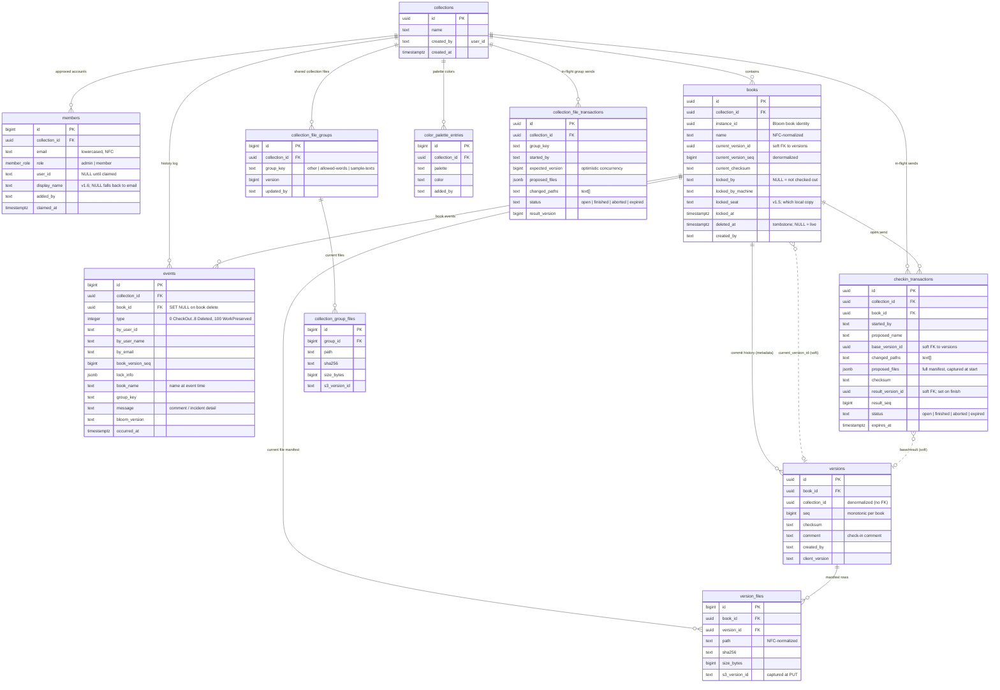

# Cloud Team Collections — database schema (`tc`)

Entity-relationship diagram of the Supabase Postgres `tc` schema. Reflects the declarative schema
in `supabase/schemas/` (the tables live in `03_tables.sql`). Renders on GitHub and in any
mermaid-aware viewer. See `CONTRACTS.md` for the RPC/edge-function surface that reads and writes
these tables (clients never write them directly — all mutations go through RLS-gated RPCs / edge
functions), including how the schema is maintained declaratively.



## Notes for readers

- **`collections` is the hub.** Almost everything hangs off a collection; a member's access to
  any row is decided by their `members` row for that collection (enforced by RLS, not shown here).
- **Book identity vs. name.** `books.instance_id` is Bloom's durable book identity (from the
  book's `meta.json`); `books.name` is the display/folder name and can change (rename-on-checkin).
  The client resolves by `instance_id`, never by name.
- **Versions & files.** Each check-in appends a `versions` row (monotonic `seq`) and rebuilds the
  current manifest in `version_files` (path + sha256 + size + the S3 object `s3_version_id`, so a
  download can pin the exact committed bytes). `books.current_version_id/seq/checksum` are
  denormalized pointers to the newest version for fast status reads.
- **`version_files` holds only the CURRENT version's files, not a history.** Check-in does
  `DELETE … WHERE book_id = …` then re-inserts, so superseded file rows are pruned; all rows for a
  book share the current `version_id`. That is why `version_files` carries `book_id` even though it
  is derivable via `version_id → versions.book_id`: the two hot operations — "read this book's
  current files" (`get_book_manifest`) and "replace this book's files" (check-in) — are both keyed
  on `book_id`, and the prune-to-current makes a `WHERE book_id` query consistent without joining
  through `current_version_id`. `version_id` is retained as the provenance stamp (returned as
  `versionId`) and the `ON DELETE CASCADE` tie. Consequence: `versions` keeps only per-version
  *metadata* (seq/checksum/comment); the file list of an older version is not retained in the DB
  (the bytes remain in the versioned S3 bucket, but no DB-side arbitrary-version restore exists).
- **Soft references (dashed lines).** `books.current_version_id`, `checkin_transactions.base_version_id`
  and `.result_version_id` are logical references to `versions`, deliberately **not** enforced FK
  constraints (an enforced `books → versions` FK would be circular with `versions → books`).
- **Collection files** (the non-book shared files: `.bloomCollection`, custom styles, Allowed
  Words, Sample Texts) live in `collection_file_groups` (one row per `group_key`, with a version
  counter) + `collection_group_files` (the current per-file manifest) — the collection-level
  analogue of `versions`/`version_files`.
- **The two `*_transactions` tables are ephemeral.** They hold in-flight state for the two-phase
  check-in / collection-files protocols (start → upload to S3 → finish); rows are reaped when
  `expires_at` passes. They are not part of the durable data model.
- **`events`** is the append-only history log behind the History panel and realtime broadcasts;
  `type` is the numeric `BookHistoryEventType`. `book_id` is nullable (`ON DELETE SET NULL`) so a
  book's history survives its deletion.

## Updating this diagram

This diagram is maintained **by hand** — it is not generated — so it must be updated whenever a
table change lands: a new / removed / renamed table or column, or a changed foreign key.

1. Make the change in `supabase/schemas/03_tables.sql` (the declarative source of truth), the same
   way you would any schema change (see `CONTRACTS.md` → "Database: declarative schema").
2. Reconcile the `erDiagram` block above with the new reality. To see the current definitions
   quickly, from the repo root:

   ```bash
   git grep -nE "CREATE TABLE"    -- supabase/schemas/03_tables.sql   # every table
   git grep -nE "REFERENCES tc\." -- supabase/schemas/03_tables.sql   # foreign keys
   ```

   (Or run `supabase db reset` and inspect the live schema, e.g. in Studio.)
3. Preview before committing: paste the fenced ```mermaid block into <https://mermaid.live>, or
   view the file on GitHub, which renders it natively.

Keep the two kinds of reference honest: solid lines are enforced foreign keys; dashed lines
(`..`) are the deliberate soft references (`current_version_id`, `base/result_version_id`). If you
add or enforce one of those, change its line style to match.
