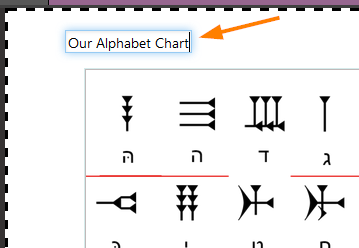
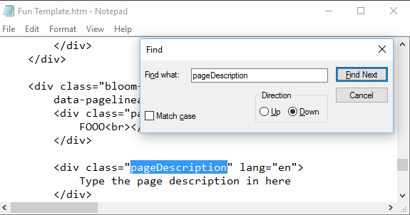

This special template lets you make your own templates. A template provides a set of related page layouts that an author can choose from in writing an original book. Usually the text blocks and picture blocks on template pages will be empty, ready for an author to fill in. Sometimes there may be standard text or pictures that should be on every copy of the page.
There are two ways people can use your template. The first way is to start new books. For example, imagine student books that have one page for each school day of the week. You could make a template with 5 pages, each with places to type in text and choose pictures. Curriculum authors could select your template and make a new book, one for each week[1](#note1).

The second way people can use templates is as source of new pages, regardless of how they started the book. For example, in some places, each book requires a page as part of a government approval process. You might make a template containing that page and give it to others in your country. Then, when people translate a shellbook, they go to the end of the book and click “Add Page”. The page you made will appear in their list of choices. Some other ideas for templates are alphabet charts, glossaries, and instructions on how to use the book in a classroom.

When you add pages to your template, make sure to give each one useful label[2](#note2),[3](@note3):

 Also consider adding a description of your template, like the one you are reading now. To do this, put a text file named ReadMe-en.md in your template's folder. This file should follow the <a href="http://spec.commonmark.org/dingus/">markdown standard</a>. To provide your instructions in other languages, make version of that file that change the "en" to another language's two letter code. For example ReadMe-fr.md would be shown when Bloom is set to show labels in French. You can also include screenshots, like we have in this document.

Notes:

<a name="note1">1</a>: These books could later be combined using the Folio feature.

<a name="note2">2</a>: People will not be able to translate your labels and descriptions into other national languages. If this is a problem, please contact the Bloom team.

<a name="note3">3</a>: If you want to the Add Page screen to also provide a short description of the page, you'll need to quite Bloom and edit the template's html in Notepad, like this: 
