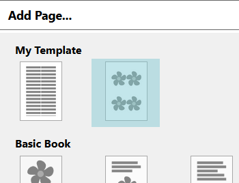

# Cómo usar la Plantilla Inicial {i18n="template.starter"}

Esta plantilla especial le permite crear sus propias plantillas. Una plantilla proporciona un conjunto de diseños de páginas relacionados que un autor puede elegir para la escritura de un libro original. Normalmente los cuadros de texto y los cuadros para imágenes en las páginas de plantilla estarán vacíos, listos para que un autor los rellene. A veces puede haber texto estándar o imágenes estándares que deben estar en cada copia de la página.
Hay dos maneras en que la gente puede usar su plantilla. La primera manera es para comenzar libros nuevos. Por ejemplo, imagine libros para estudiantes que tengan una página por cada día escolar de la semana. Usted podría hacer una plantilla con 5 páginas, cada una con cuadros para ingresar texto y elegir imágenes. Los autores de currículo podrían seleccionar su plantilla y crear un nuevo libro, uno por cada semana[1](#note1). {i18n="template.starter.firstusage"}

La segunda manera que la gente puede utilizar las plantillas es como fuente para nuevas páginas, no importando cómo comenzaron el libro. Por ejemplo, en algunos lugares, cada libro requiere una página específica como parte de un proceso de aprobación del gobierno. Puede crear una plantilla que contenga esa página y entregársela a otros en su país. Luego, cuando otros traduzcan un Libro Prediseñado, pueden ir al final del libro y hacer clic en "Agregar página". La página que usted hizo aparecerá en la lista de opciones. Algunas otras ideas para plantillas incluyen tablas del alfabeto, glosarios e instrucciones sobre cómo usar el libro en un aula.[2](#note1) {i18n="template.starter.secondusage"}

Las plantillas se hacen del mismo modo que cualquier otro libro personalizado; todos los mismos controles están disponibles para hacer y personalizar las páginas. Pero dado que probablemente estará compartiendo las plantillas con otras personas, hay varias cosas que puede hacer para ayudar a los usuarios de su plantilla: {i18n="template.starter.waystohelp"}

## Etiquetar sus páginas {i18n="template.starter.labelpages"}
Cuando agrega páginas a su plantilla, dé a cada página una etiqueta útil [3](#note2),[4](@note3): {i18n="template.starter.labeleachpage"}

![custom label]{i18n="template.starter.labelexample"}(ReadMeImages/customLabel.png)

## Revise sus miniaturas {i18n="template.starter.thumbnails"}
Para ser mas eficiente, Bloom solamente hace esta miniatura una vez y lo guarda en el subdirectorio "plantilla" de su plantilla: {i18n="template.starter.thumbnails.onlyonce"}

Si luego usted hace un cambio a la página, la miniatura de imagen será obsoleta. Para corregirlo, haga clic en el botón "Añadir página", y Bloom regenerará las miniaturas. Si la miniatura automáticamente generada no comunica bien el propósito de la página, usted puede hacer su propia miniatura. Pero es importante marcar ese archivo con "Sólo Lectura" para que Bloom no escriba sobre ella. Si prefiere, también puede hacer sus miniaturas como archivos svgs. (Esto es lo que hacemos para las plantillas que enviamos con Bloom).  En cualquier caso, hay que hacer clic en "Añadir página" por lo menos una vez antes de distribuir su plantilla para que todas las miniaturas se generen. {i18n="template.starter.thumbnails.update"}

## Documentar su plantilla {i18n="template.starter.document"}

También considere agregar una descripción de su plantilla, como la que está leyendo ahorita. Para hacer esto, coloque un archivo de texto llamado ReadMe-en.md en la carpeta que contiene su plantilla. Este archivo debe seguir el protocolo [markdown standard](http://spec.commonmark.org/dingus/). Para proporcionar las instrucciones en otros idiomas, debe hacer versiones de ese archivo que cambian el "en" a dos letras del código de cada idioma. Por ejemplo ReadMe-es.md se mostrará cuando Bloom esta configurado para mostrar etiquetas en español. También puede incluir capturas de pantallas, como las que tenemos en este documento. Coloque todas las imágenes que usa en una carpeta llamada "ReadMeImages", para que las imágenes sean referenciadas de esta forma: {i18n="template.starter.describeyours"}

``

Cuando el cuadro de diálogo "Agregar página" muestre sus páginas de plantilla, mostrará una miniatura: {i18n="template.starter.thumbnailsshown"}

## Comparta su plantilla {i18n="template.starter.share"}
Recuerde que Bloom se trata de plantar semillas y compartirlas. Así que planee compartir su plantilla en la Biblioteca de Bloom para que personas en todo el mundo las puedan encontrar. Esto solamente requiere algunos clics en la pestaña "Publicar". {i18n="template.starter.share.publish"}

Para colegas locales, una manera fácil de distribuir su plantilla es a través de un Paquete Bloom. En la pestaña de Colecciones, haga clic derecho en la miniatura de la plantilla. Elija 'Crear un Paquete de Bloom'. Guárdelo en algún lugar, por ejemplo en una memoria USB. Luego conéctelo en otra computadora, haga doble clic sobre el archivo que hizo, y su plantilla será añadida a las "Fuentes para nuevos libros " en esa computadora. {i18n="template.starter.share.bloompack"}

## Notas {i18n="template.starter.notes"}

<a name="note1">1</a>: Estos libros podrían ser combinados en el futuro con la inminente función de Folio. Tenga en cuenta que Bloom 3.9 todavía no tiene un mecanismo para indicar que una página debe ser incluida automáticamente en los nuevos libros; el autor tendrá que agregar cada página desde el cuadro de diálogo "Agregar Página". {i18n="template.starter.nothingautomatic"}

<a name="note2">2</a>: Si no desea que las páginas de su plantilla se muestren en el cuadro de diálogo "Agregar Página", usted puede indicarle esto a Bloom mediante la creación de un archivo llamado "NotForAddPage.txt." en la carpeta de Plantillas del Libro. {i18n="template.starter.nametonotaddpage"}

<a name="note3">3</a>: Otras personas no serán capaces de traducir sus etiquetas y descripciones a otros idiomas nacionales. Si esto es problemático, póngase en contacto con el equipo técnico de Bloom. {i18n="template.starter.labelsnottranslatable"}

<a name="note4">4</a>: Si desea que la pantalla de "Agregar Página" también proporcione una descripción breve de la página, tendrá que salirse de Bloom y editar el archivo html de la plantilla en Notepad, de esta manera:  {i18n="template.starter.editrawhtml"}
