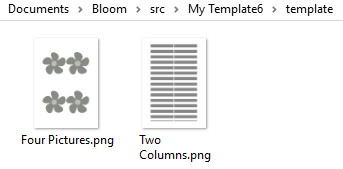

# How to use the Template Starter {i18n="template.starter"}

This special template lets you make your own templates. A template provides a set of related page layouts that an author can choose from in writing an original book. Usually the text blocks and picture blocks on template pages will be empty, ready for an author to fill in. Sometimes there may be standard text or pictures that should be on every copy of the page.
There are two ways people can use your template. The first way is to start new books. For example, imagine student books that have one page for each school day of the week. You could make a template with 5 pages, each with places to type in text and choose pictures. Curriculum authors could select your template and make a new book, one for each week[1](#note1). {i18n="template.starter.firstusage"}

The second way people can use templates is as source of new pages, regardless of how they started the book. For example, in some places, each book requires a page as part of a government approval process. You might make a template containing that page and give it to others in your country. Then, when people translate a shellbook, they go to the end of the book and click “Add Page”. The page you made will appear in their list of choices. Some other ideas for templates are alphabet charts, glossaries, and instructions on how to use the book in a classroom. [2](#note2) {i18n="template.starter.secondusage"}

Making templates is just like making any other custom book; all the same controls are available for making and customizing pages. But since you will probably be sharing with other people, there are a number of things you can do to help users of your template: {i18n="template.starter.waystohelp"}

## Label Your Pages {i18n="template.starter.labelpages"}
When you add pages to your template, make sure to give each one a useful label[3](#note3),[4](#note4): {i18n="template.starter.labeleachpage"}

 {i18n="template.starter.labelexample"}

## Check Your Thumbnails {i18n="template.starter.thumbnails"}
To speed things up, Bloom only makes this thumbnail once, and stores it in the "template" subdirectory of your template: {i18n="template.starter.thumbnails.onlyonce"}

 If you later make a change to the page, the thumbnail will be out of date. To fix that, click the "Add Page" button, and Bloom will regenerate those thumbnails. If the automatically generated thumbnail doesn't convey the purpose of the page, you can make your own. Just make sure to mark the file as "Read Only" so that Bloom doesn't overwrite it. You can also make your thumbnails as svgs, if you like (that's what we do for templates we ship with Bloom).  In any case, make sure to click "Add Page" at least once before distributing your template, so that all the thumbnails are already generated. {i18n="template.starter.thumbnails.update"}

## Document Your Template {i18n="template.starter.document"}

Also consider adding a description of your template, like the one you are reading now. To do this, put a text file named `ReadMe-en.md` in your template's folder. This file should follow the [markdown standard](http://spec.commonmark.org/dingus/). To provide your instructions in other languages, make versions of that file that change the "en" to each language's two letter code. For example `ReadMe-fr.md` would be shown when Bloom is set to show labels in French. You can also include screenshots, like we have in this document. Place any images you use in a folder named "ReadMeImages", so that images are referenced like this: {i18n="template.starter.describeyours"}

``

When the Add Page dialog box shows your template pages, it will show a thumbnail: {i18n="template.starter.thumbnailsshown"}

## Share Your Template {i18n="template.starter.share"}
Remember that Bloom is about planting seeds, about sharing. So plan to share your template on the BloomLibrary for people around the world to find. This takes just a few clicks in the Publish Tab. {i18n="template.starter.share.publish"}

For local colleagues, an easy way to distribute your template is via a Bloom Pack. In the collections tab, right-click on your template's thumbnail. Choose 'Make Bloom Pack'. Save that somewhere, for example to a USB Key. Then take it to another computer, double click on the file you made, and your template will be added to the "Sources for New Books" on that computer. {i18n="template.starter.share.bloompack"}

## Notes {i18n="template.starter.notes"}

<a id="note1">1</a>: These books could later be combined using the forthcoming Folio feature. Note that Bloom does not yet give you a way to indicate that a page should be automatically included in new books; the author will have to add each one from the Add Page dialog. {i18n="template.starter.nothingautomatic"}

<a id="note2">2</a>: If you don't want the pages in your template to show up in the Add Page dialog, you can indicate this to Bloom by creating a file in the book's template folder called NotForAddPage.txt. {i18n="template.starter.nametonotaddpage"}

<a id="note3">3</a>: People will not be able to translate your labels and descriptions into other national languages. If this is a problem, please contact the Bloom team. {i18n="template.starter.labelsnottranslatable"}

<a id="note4">4</a>: If you want the Add Page screen to also provide a short description of the page, you'll need to quit Bloom and edit the template's html in Notepad, like this:  {i18n="template.starter.editrawhtml"}

